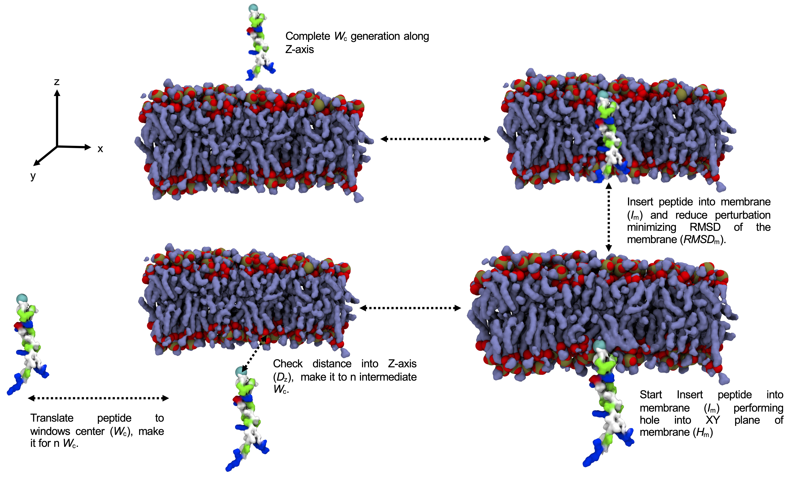

# FEMWgen  : A computational tool to generate multiple windows                     
#            for free-energy calculations.  



## Installation
To use the code you can download using the following command:

```bash
giit clone https://github.com/groponp/FEMWgen.git 
```
## Requirements
To run our code you need python > 3.x and the following packages:
- Optparse
- Colorama
- VMD-python last version
- Glob
- Json

```bash
conda create -n femwgen  python=3 -y 
conda activate femwgen 
````

## Usage


```bash
#! To get help running
python FEMWgen.py --help 
```

```bash
#! Fot get usage example running
python FEMWgen.py --usage

#! it can print following
Common usage NAMD only:
-----------------------
python FEMWgen.py --psff=sistema.psf --pdbf=sistema.pdb --bin=2 --lresn="POPC POPG" --pref="resname TRP and name CH2"
--lref="resname POPC POPG and name P" --lrst="serial 38224 40079 39148 39811 20055 14892 19787 18877"
--namd="$HOME/Documents/packages/NAMD_2.14_MacOSX-x86_64-multicore/namd2" --nproc=2 --cfw=-38 --seltxt="protein" --nw=60

Common usage NAMD w/ CHARMM++:
------------------------------
python FEMWgen.py --psff=sistema.psf --pdbf=sistema.pdb --bin=2 --lresn="POPC POPG" --pref="resname TRP and name CH2"
--lref="resname POPC POPG and name P" --lrst="serial 38224 40079 39148 39811 20055 14892 19787 18877"
--namd="$HOME/Documents/packages/NAMD_2.14_MacOSX-x86_64-multicore/namd2" --nproc=2 --charm="$HOME/Documents/packages/charmrun/charmrun" --cfw=-38 --seltxt="protein" --nw=60

Restart usage:
--------------
python FEMWgen.py --restart="True" --chkpoint=FEMWgen.chkpoint --jsonfile=FEMWgen.json --cfw=-38 --seltxt="protein"
```

```python

#! import module
import FEMWgenLIB

#! Setting parameters
mkw = FEMWgenLIB.MakeWindows(psff="sistema.psf", pdbf="sistema.pdb", Bin=2, lresn="POPC POPG", refprot="resname TRP and name CH2",
                   refmemb="resname POPC POPG and name P", rstmemb="serial 38224 40079 39148 39811 20055 14892 19787 18877",
                   namdPATH="$HOME/Documents/packages/NAMD_2.14_MacOSX-x86_64-multicore/namd2", nproc=2)

#! Write parameters as Json file, necesary to restart computation 
FEMWgenLIB.IO.writrJsonParms(ofile="FEMWgen.json", dic=mkw.__dict__)
mkw.__dict__

#! Running computation 
mkw.iterateWindows(cfw=-38, seltxt="protein", N=20)


#! If your computation stop for any reason continue with restart mehtod.
restart = FEMWgenLIB.RestartWindows()

#! Use checkpoint to restrart from last step
windowsOK = restart.get_NotiterateWindows("FEMWgen.chkpoint")
windowsOK

#! Running restart
restart.restart(windowsOK, cfw=-38, seltxt="protein", jsonfile="FEMWgen.json")
```

```tcl
#! Use it into tkcosnsole into vmd or with tcl script of vmd with graphics off
source FEMWgen_v1.0b.tcl 
package require FEWgen 

#! For get help. It have all methods as python version except for restart function
FEWgen -h 

```
A configs file and sample coordinates and topology could be found in the FEWgen1.0_PythonModule/configs folder.

## Authors

The code was written by :
Alexandre Suman de Araujo, Luiz Fernando Zonetti e Ropón-Palacios G.

Main developer:
Ropón-Palacios G. <groponp@gmail.com> 

## Reference 
If you want to get a theoretical framework of this code please check out our kddk article. If you use our code please cite it.

## License

[MIT](https://choosealicense.com/licenses/mit/)